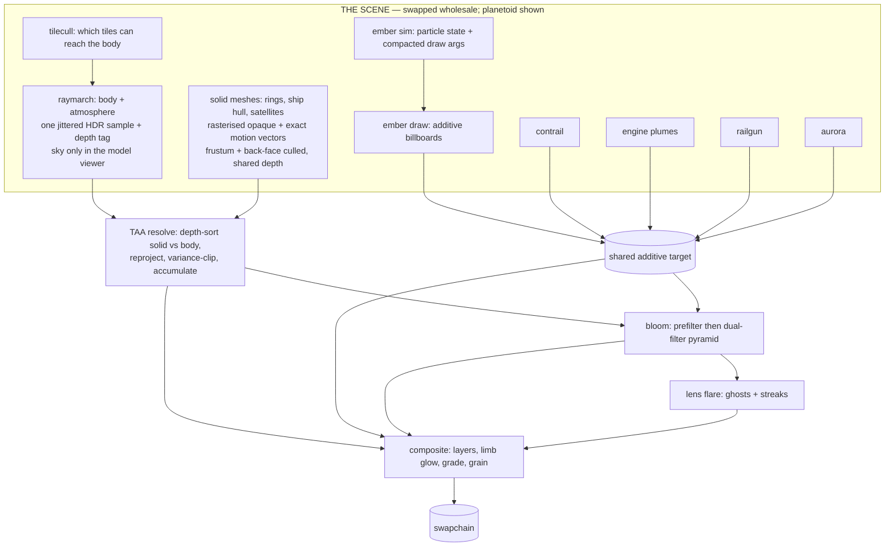

# Architecture

The README says how to run this, where each file is, and what every knob does. This document
is the layer above that: what the pieces are, who owns what, and the handful of contracts that
the whole pipeline depends on. If you are about to touch the temporal side, read
[The temporal contract](#the-temporal-contract) first — almost every bug this renderer has had
lived in it, and it is the one part where a change that looks local is not.

## What this is

A WebGPU renderer with two scenes. The main one is a raymarched signed-distance planetoid on a
spherical-Fibonacci lattice, lit as a scattering medium, with rasterised metal rings, a ship and
satellites contoured from their own distance fields, GPU particles, curl-noise auroras, a volumetric
atmosphere, temporal antialiasing with upsampling, and an analytic film grade. The second is a model
viewer — a turntable for inspecting those generated meshes, sharing the entire post chain.

It is deliberately **not** an engine. There is no scene graph, no material system, no asset pipeline,
and no build step — a "scene" here is six methods, not a hierarchy. Everything is procedural, which is
what buys the two properties the design leans on hardest:

- **Nothing is loaded**, so the whole thing is a static page and a shader cache.
- **Everything can say where it was last frame**, because positions come from closed-form
  functions of time rather than from stored state. That is what makes exact motion vectors
  possible for moving geometry, and it is the backbone of the temporal contract below.

Two vendored MIT dependencies (`lil-gui`, `mp4-muxer`), both loaded on demand, neither on the
startup path.

## Layers and ownership

Each layer knows only about the ones below it. The arrows in the frame graph are data; the
layering here is *authority* — who is allowed to decide a thing.

| Layer | Files | Owns | Must not |
|---|---|---|---|
| Boot | `main.js` | the rAF loop, the clock, input wiring, keys, the debug surface on `window.beep` | know how any pass works |
| Frame graph | `renderer.js` | the **order** of passes, per-frame scene updates, uniform assembly | contain rendering logic |
| Passes | `passes/*.js` | how one pass records itself: pipeline, bind groups, draw | know when it runs, or what runs next |
| Resources | `core/targets.js`, `core/uniforms.js`, `core/profiler.js`, `core/device.js` | every texture and buffer, the uniform block layout, timing | make art decisions |
| Scene | `scene/*.js` | simulation and state: camera, ship, contrail, aurora, rail guns, lattice | touch the GPU |
| Tuning | `scene/tuning.js` | **every** art number, and which of them are shader constants vs runtime uniforms | contain logic |
| Shaders | `shaders/*.wgsl` | shading, marching, the resolve | allocate or decide order |

`renderer.js` owning order *and nothing else* is what makes the pipeline extensible: adding a
pass is one class plus one line. The shader include graph is kept deliberately shallow for the
same reason — `brdf.wgsl` and `fibonacci.wgsl` were extracted precisely so that lighting a
surface or drawing a star does not pull in the marched body.

## Scenes

The renderer draws a SCENE. There are three, and the split falls where the frame graph already had a
seam.

| | Owns |
|---|---|
| **Scene** (`scenes/*.js`) | the world: what exists, how it moves, where the camera goes, and the passes that draw it |
| **Renderer** (`renderer.js`) | everything after the sample: temporal resolve, bloom, flare, grade, buffer viewer, and the frame uniform |

`scenes/planetoid.js` is the original — the marched body, the rings, the ship, the satellites and the
additive layer. `scenes/modelview.js` is a turntable for inspecting the generated meshes on their own,
since there is no file to open in a modelling tool. `scenes/chibi.js` is a self-contained march — a
grass football planet — that drops the satellite and aurora passes in unchanged. All are constructed
and initialised at startup, so switching is a property change rather than a load; they share the ship's
and satellite's contoured meshes through memos, so a second scene costs GPU buffers rather than another
~135 ms of contouring.

The contract is six methods and a getter — `init`, `update`, `writeState`, `recordWorld`,
`recordAdditive`, `destroy`, and `solidPasses`. LOD selection and the wireframe view apply to whatever
a scene lists in `solidPasses`, because both are properties of how this renderer draws meshes rather
than of what any scene contains: a new scene gets both by listing its passes.

The alternative was an `if (modelView)` through `frame()`. That works for two scenes and collapses at
three, and it puts the viewer's concerns inside the code that has to stay correct for the real scene. A
scene that cannot reach into the frame graph cannot break it.

**The model viewer still runs the march pass.** It needs a backdrop, a depth tag of "background"
everywhere the model is not, and a motion sentinel, and the scene pass already produces all three; a
`studio` flag in `raymarch.wgsl` drops the body, the plumes and the atmosphere and leaves the sky.
Skipping it outright would leave the previous scene's samples in the buffer for the resolve to blend
against. It also draws through the models' **own** shaders — a viewer with its own simplified shader
shows you a model nothing else renders, and hides exactly the discrepancies you opened it to find.

**A camera can be orbited or placed, and the two maintain different quantities.** `Camera.update`
orbits: `distance` is the orbit RADIUS, and the subject — the body's near surface — is `focusPull`
closer, so `focus` is a correction away from it. `Camera.lookAt` places: the caller already measured
the distance to its subject, so `distance` and `focus` are the same number and no correction applies.
Conflating them is not academic — it put the model viewer's focal plane at the clamp floor and its LOD
two levels too coarse.

Two more details are load-bearing rather than cosmetic. The model spins and the camera does not, because
rotating the camera keeps the lighting fixed to the model and shows the same shading from every angle.
And the studio sits 200 units from the world origin: the hull's material carries a core-light term
falling off as 1/|p|², so a model at the origin would be lit by a planet the viewer deliberately does
not draw — and a vertex landing exactly on it would normalise a zero vector. That distance is asserted
in `dev/scenes.mjs` rather than left as a comment.

## The frame graph

Everything inside the box belongs to the active scene; everything outside it is shared, and the model
viewer reaches the swapchain through exactly the same resolve, bloom, flare and grade.

The march used to own three of those: the body, then the satellites, then the ship, each narrowing
the next one's `tmax` so the set resolved front-to-back with no sorting. **All three are now
triangle meshes** and live in the solid layer, where hardware depth does that sorting
for free — see *Generated geometry* below for what that bought and what it cost. What is left in the
march is the body and the engine plumes, which are volumetric and belong there.

The atmosphere still integrates **last**, once `tmax` is final, because it must stop at whatever
ended up nearest — and `tmax` now accounts only for the body, with the resolve settling the rest by
depth.

### The rule that sets the order

> Anything camera-relative, or world-space dynamic that cannot say where it was last frame, must
> **not** enter the accumulation buffer.

Reprojection assumes static geometry. That single rule is why embers, flares, the limb glow, the
explosion fireballs and the grain all live downstream of TAA, and why they get no antialiasing —
a cost accepted deliberately, and measured (see `beep.additive()`).

The **rings are the exception that proves it**: they move, but analytically, so they hand TAA an
exact motion vector instead of asking it to guess. The admission criterion is not "static", it is
*"can you tell me where you were"*.

## The temporal contract

This is the load-bearing part. Four things have to agree, and they are spread across
`raymarch.wgsl`, `rings.wgsl`, `common.wgsl` and `taa.wgsl`.

### 1. Pixel centres

A pixel centre is `integer + 0.5`. `screenUV(px)` maps a pixel to shared screen space and
`uvToPixel` is its exact inverse; both assume centres. Pass a bare integer corner and you get a
half-pixel bias that is invisible in a still frame and reads as crawl in motion.

### 2. One jitter, and the one that was removed

`frame.jitter.xy` is the sub-pixel offset on the ray. **It is the antialiasing**, it is an unbounded
low-discrepancy sequence, and `PROBE.zeroJitter` (or `j`) is the only thing that turns it off. With
it off and the scene stopped, the frame is bit-exact — which is the baseline every stability figure
in this repo is measured against.

`jitter.zw` used to carry a second, unrelated thing: an offset on the lens disk for depth of field.
It is gone, and the reason is worth keeping because it is the same reason twice:

- **It could not converge.** One lens sample per frame amortised over the history never settles,
  because the variance clip pulls the history back toward each frame's newest sample. Measured on a
  stopped scene: 0.457% of pixels moving by more than 4 of 255 levels with the lens, against 0.107%
  for the pixel jitter alone.
- **It missed half the scene.** A lens offset moves a *ray origin*, which only exists in the compute
  passes. The rings are rasterised through `jitterClip(frame.viewProj * …)`, which carries the pixel
  jitter and nothing else — so at a wide aperture the rings were the only stable thing on screen.
  That asymmetry is what exposed it.

Neither jitter ever had anything to do with temporal *upsampling*, so `u` does not affect them — a
distinction that cost real debugging time. Bringing depth of field back means a deterministic
post-process gather; the design is recorded in `CAMERA` in `tuning.js`.

### 3. Three ways to answer "where was this pixel last frame"

All three must land in the **same frame of reference**: unjittered pixel centres, which is how
the history is indexed. They differ only in how they get there.

| Content | Method | Jitter handling |
|---|---|---|
| Body, sky | reproject the world hit through `prevViewProj` | subtract `jitter/toIn` — the hit is on a jittered ray |
| Solid meshes (rings, hull, satellites) | vertex shader emits `prevClip` | **add** jitter back to `in.pos.xy`, because `jitterClip` shifted the geometry |

The consumer does `rp = opc + motionPx` with no correction, so the correction has to be in the
producer. Every rasterised layer now takes the same route through `meshXform` in `mesh_vertex.wgsl`,
so there is one place to be right rather than three. The `motionFor` helper the marched ship and
satellites once shared lost its last caller in the move and was removed with them.

**Every previous position is evaluated, not stored.** `ringDefAt(i, t)`, `satPart(i, part, t)` and the
ship's own integrated pose are each asked the same question one frame back: no velocity buffer, no
history texture, no extrapolation. That is the property that makes the vectors exact rather than
approximately right, and it is why the transforms are all parameterised on time instead of reading
the clock.

### 4. Depth tags

The accumulation buffer's **alpha is the hit distance**, doubling as a classifier: which object a
pixel is, and how far. Negative means background, and that is now the only negative — a second
encoding used to bias a distance into the negatives to mark geometry "dynamic", which the resolve
answered by reading history from the same screen pixel with no reprojection at all. Its last user
was the satellites, and once they carried real motion vectors it had no writers and was removed. TAA's gate compares it against the distance measured from the *previous*
camera (`prevCamPos` exists for exactly this), because a distance written by a camera that has
since moved is not comparable to one from where the camera is now.

The gate is slope-scaled, like a rasteriser's `depthBiasSlopeScale`: a flat tolerance rejects
valid history across steep surfaces, where one pixel of reprojection slide is legitimately a large
depth change.

A secondary **velocity-based disocclusion** gate tightens further: when reprojected motion exceeds
8 output pixels, a flat 1%-of-distance threshold overrides the slope-scaled tolerance. This catches
surfaces that were genuinely occluded last frame but whose depth happens to fall within the
permissive slope-scaled gate — the classic fast-pan ghosting case.

### 5. What convergence is actually limited by

History is combined by variance clipping (Salvi/Karis) in YCoCg, not by a luma-difference guard —
the samples here are noisy by construction (few-tap AO, SSS, transmission), so any guard tight
enough to stop ghosting also stops accumulation.

The consequence is the most counter-intuitive property of the whole system, and it is measured:

> **More history does not make a noisy sample converge.** The clip box is rebuilt every frame from
> the current neighbourhood, so it pulls the history back toward the newest sample no matter how
> much weight the history carries. `weightMax` 6 → 200 and `blend` 0.15 → 0.04 both change nothing.

Two corollaries that explain otherwise-baffling tuning:

- A **per-pixel** temporal dither makes neighbours disagree, inflates sigma, and admits stale
  history *everywhere*. A **global per-frame** offset shared by all nine taps moves the box with
  the sample and is free. `volumetric.wgsl`'s step offset is built exactly that way.
- Depth of field could not converge through this at all, which is why the thin lens was removed
  rather than tuned. Any effect that needs several samples of one quantity must take them *within a
  frame*, not borrow them from previous frames.

## Generated geometry

Three of the scene's four solid objects are triangle meshes built on the CPU at startup. None of them
is an asset: there is no file to load, and the shapes are code.

| Object | Source | Built by | Triangles |
|---|---|---|---|
| Rings | `rectTube` — a revolved rectangular profile | `meshgen.js` | 3 × 768 |
| Planet body | `mapBody` — fBM + crater SDF in `sdf.wgsl` | `planet_surfacenets.wgsl` (GPU Surface Nets / DC) | ~19k–77k (resolution-dependent) |
| Ship hull | an SDF **tree** in `ship_sdf.js` | `sdf/octree.js` | 14.2k / 10.8k / 7.1k / 4.3k (4 LODs) |
| Satellites | two SDF trees in `satellite_sdf.js` | `sdf/octree.js` | 4.6k bus + 2.9k wing, instanced |

### The SDF pipeline

`sdf/nodes.js` is the shape language: primitives (sphere, box, rounded box, cylinder, cone, plane),
booleans and smooth blends, the transforms, and a limited `repeat` for rows of greeble. It is **data**, not closures — a tree you can
inspect, bound and mesh — and `compile()` turns it into nested closures once so that meshing is not
paying a dispatch per node per sample.

Two invariants make the rest work. Every primitive returns an **exact Euclidean distance**, not a
bound, because dual contouring places vertices by root-finding along edges and a conservative bound
puts them in the wrong place. And `scale` is **uniform only**: a non-uniform scale is not a distance
field any more, and the failure is subtle enough that the operator refuses rather than approximates.

Dual contouring rather than marching cubes for one reason that is visible in the result: it places one
vertex per cell by minimising a **QEF** over the crossing planes, so a sharp edge is reconstructed as
a sharp edge. Marching cubes bevels every one of them, which for a hard-surface hull is the whole
silhouette. The QEF is Tikhonov-regularised toward the cell's mass point and the solution is clamped
into its own cell, because an unregularised QEF on a nearly-flat cell is ill-conditioned and throws
its vertex somewhere across the mesh.

The pipeline is three files, split where the responsibilities actually divide:

| File | Owns |
|---|---|
| `sdf/grid.js` | sampling the field and finding the crossings — the expensive half, shared |
| `sdf/qef.js` | the error function, in the form that can be **added** |
| `sdf/octree.js` | the octree, its simplification, and the crack-free weave |
| `sdf/dualcontour.js` | the uniform weave — the reference the adaptive one is checked against |

### Adaptive simplification, and why it is on the octree

A uniform grid spends the same triangles on a flat wing panel as on the nozzle rim, because it has no
way to tell them apart. `octree.js` merges any eight cells whose surface a single vertex can represent
to within a stated error, so triangles end up where the shape actually curves.

The obvious alternative is to contour uniformly and then decimate with a quadric error metric. But
dual contouring **has already computed that metric** — the QEF each cell solves is a quadric, built
from the field's own gradients rather than reconstructed from the triangles those gradients produced.
Decimating afterwards throws that away, rebuilds an approximation of it from the mesh, and pays for a
full-resolution mesh first. Simplifying the octree uses the exact quantity and never builds the
triangles it is going to delete.

Two properties make it work:

- **The QEF is additive.** In normal-equation form (`A = Σ nnᵀ`, `b = Σ n(n·p)`, `c = Σ (n·p)²`) a
  parent's error is the exact sum of its children's, with no reference to the original planes. So one
  threshold means the same thing at every level of the tree.
- **Cracks are handled by the traversal, not by patching.** Where a merged cell meets small ones the
  surface still has to be one closed sheet. The `cellProc` / `faceProc` / `edgeProc` descent (Ju et
  al., *Dual Contouring of Hermite Data*, 2002) enumerates every minimal edge exactly once regardless
  of how the tree is refined around it.

Flat regions merge **for free**: a box drops from 13068 to 3732 triangles at a threshold of *zero*,
with byte-identical accuracy, because eight coplanar cells genuinely cost one vertex no error at all.

One addition to Ju's formulation was necessary. It checks only the error before collapsing, which is
where adaptive DC's non-manifold vertices come from: a merged cell whose corner signs describe **two**
separate surface sheets gets one vertex, welding them into a pinch. A 256-entry table
(`SINGLE_SHEET`) refuses those collapses — the conservative half of what Manifold Dual Contouring
(2007) does properly. With it, every level is closed, manifold and genus-0.

### GPU Surface Nets / Dual Contouring (`planet_surfacenets.wgsl`, `SurfaceNetsManager.js`)

The planet body itself is also meshed on the GPU, in a **3-pass cached-corner pipeline** that
replaces the old UV-sphere displacement approach. It evaluates the same `mapBody` SDF at every
corner of a 3D grid exactly once, then extracts an isosurface as triangle geometry — either via
**Surface Nets** (centroid of edge crossings, fast, ideal for smooth fields) or full **Dual
Contouring** (QEF solve over crossing planes, preserving sharp features). A toggle in the tuning
panel switches between them.

#### Architecture

The pipeline uses four compute dispatches, each in its own pass for WebGPU ordering:

| Pass | Entry point | Workgroup | What it does |
|------|------------|-----------|-------------|
| 0 | `clear_buffers` | 64×1×1 | Resets indirect draw args + fills cell vertex IDs with -1 |
| 1 | `eval_corners` | 4×4×4 | One `mapBody()` call per grid corner → `cornerBuffer` |
| 2 | `compute_vertices` | 4×4×4 | Finds surface cells via 12-edge sign-change test; places a dual vertex (centroid for Surface Nets, QEF minimiser for DC) with `calcNormal`; atomically assigns a compact vertex slot |
| 3 | `generate_faces` | 4×4×4 | Processes three anchor edges per cell; when an edge crosses the surface, stitches a quad between the four surrounding cells' dual vertices; atomically reserves index slots |

The cached-corner design means a corner shared by up to 8 cells is evaluated once rather than
eight times — at `lateralRes=48, depthRes=32` (~80k corners) this is an ~8× reduction over the
naive per-cell approach and keeps the driver from timing out.

**Vertex mapping is sparse.** An atomic counter (`vertexCount` in the indirect draw buffer at
byte 20) assigns compact slots only to surface cells. Non-surface cells store -1. The face pass
checks all four neighbouring cells' vertex IDs before emitting a quad, so the index buffer
references only valid vertices.

**The indirect draw buffer** carries both the standard 20-byte `drawIndexedIndirect` layout
(`indexCount` at offset 0 is atomic) and the vertex counter at byte 20. `drawIndexedIndirect`
reads only the first 20 bytes; the extra 4 are invisible to the draw call.

#### Grid resolution & mode

Two grid modes, toggled via the `gridMode` dropdown in the tuning panel:

**World mode** (default) — an axis-aligned cube centered on the body origin. Uniform cell sizes
within each axis, rectangular prisms. Best for orbital viewing where depth variation across the
visible surface is small. Vertices are temporally stable (the grid never moves), giving exact
motion vectors.

**Frustum mode** — the grid is projected from NDC through `frame.invViewProj`. X and Y cover the
full screen, Z slices are placed uniformly in NDC depth, which maps to non-uniform world-space
spacing (denser near the camera, sparser far away). This gives roughly constant screen-space
triangle density regardless of viewing distance. The `nearDist` and `farDist` sliders control the
world-space depth range the grid covers. Useful for fly-by cameras and terrain-like surfaces.

Resolution is controlled by three sliders:

- **lateral res** — cells across the shorter screen axis (height). Width auto-adjusts to
  `lateralRes × aspect` so cells project to roughly square pixels.
- **depth res** — cells along the view depth axis, independent of lateral resolution.
- **near dist / far dist** — (frustum mode only) world-space depth range in front of the camera.

The edge interpolation that places Surface Nets / DC vertices does not assume cubic cells, so
non-uniform spacing works correctly in both modes.

#### QEF solver

When dual contouring is enabled, `compute_vertices` calls `solveQef()` — a direct WGSL port of
the proven solver in `src/scene/sdf/qef.js`. For each edge crossing it computes the field's
gradient via `calcNormal` (4 additional SDF samples), accumulates the normal equations
(`A = Σ nnᵀ`, `b = Σ n(n·p)`), solves the 3×3 system via Cramer's rule with Tikhonov
regularisation toward the mass point, and clamps the result into the cell. The solver is
structurally identical to the CPU version used for the ship hull.

On the planet's smooth fBM field the QEF and Surface Nets centroids produce near-identical
results — DC earns its keep on hard-surface SDFs with sharp edges (boxes, boolean cuts).

#### Winding

The face pass uses the same right-handed quad ordering as the CPU `dualcontour.js`:

| Edge axis | Perpendicular pair | Quad vertex order |
|-----------|-------------------|-------------------|
| X | (Y, Z) | `(x, y-1, z-1)`, `(x, y, z-1)`, `(x, y, z)`, `(x, y-1, z)` |
| Y | (Z, X) | `(x-1, y, z-1)`, `(x-1, y, z)`, `(x, y, z)`, `(x, y, z-1)` |
| Z | (X, Y) | `(x-1, y-1, z)`, `(x, y-1, z)`, `(x, y, z)`, `(x-1, y, z)` |

The flip is determined by the sign at the edge's low corner: `flip = (corner0 > 0)`. The same
`emitQuad` triangle decomposition as the CPU code guarantees outward-facing normals on all three
axes simultaneously.

#### Motion vectors & debug views

Vertices are stored **camera-relative** (`worldPos - cameraPos`) to match the convention in
`planet_raster.wgsl`, which reconstructs world position as `rel + cameraPos` and computes motion
vectors from the NDC delta between the current and previous frame's camera-relative position,
projected through `projNoTrans`.

The B key cycles through 6 debug views rendered by the fragment shader:

| Mode | Name | Rendering |
|------|------|-----------|
| 0 | Lit | Production: `shadeBody` + volumetric |
| 1 | Motion | Motion-vector magnitude RGB |
| 2 | SDF parity | Green=on surface, red=outside, blue=inside |
| 3 | Grid | `fract(worldPos)` vertex-density heatmap |
| 4 | Normals | `calcNormal` remapped to RGB |
| 5 | Winding | Face normal vs SDF gradient alignment |

All six use the same triangle-list pipeline with `drawIndexedIndirect`.

#### Vertex layout & normal encoding

Each vertex is **camera-relative position (3 × f32) followed by the normal**, and the normal's
storage format is a build-time choice (`SN_NORMAL.bits` in `tuning.js`):

| `SN_NORMAL.bits` | Normal storage | Stride |
|------------------|----------------|--------|
| 0 | `float32x3` (lossless) | 6 floats |
| 16 (default) | one f32 holding a Fibonacci-spiral index | 4 floats |

The normal is written but **not yet read** by `planet_raster.wgsl` — its fragment stage re-derives
the normal from the SDF gradient (`calcNormal`). It is kept rather than dropped because a smooth,
interpolated per-vertex normal is the obvious future route to cheaper shading, and its storage
format can be decided now while it is cheap.

The packed form encodes a unit vector as **one index into a 65536-point spherical-Fibonacci
spiral** (`fibNearestIndex` / `fibDecodeNormal` in `fibonacci.wgsl` — the same lattice family the
SDF already uses). Unlike an octahedral mapping, whose two 8-bit halves waste the square's corners
outside the diamond, the spiral keeps every point valid and roughly uniformly dense, and its bit
width is arbitrary (`N = 2^bits`, so more bits are pure precision). Measured at 16 bits the max
angular error is ~0.56°, mean ~0.30°.

Riding in a single f32 slot, the packed normal saves 8 bytes per vertex (stride 6 → 4, normal
12 → 4 bytes); the slot still has room for a second 16-bit value later without touching the layout.

The stride is **injected** as `SN_VERTEX_STRIDE`, not declared locally, so the mesher
(`planet_surfacenets.wgsl`), the drawer (`planet_raster.wgsl`) and `SurfaceNetsManager`'s buffer
size all index the shared vertex buffer with the same number — a mismatch is a garbled mesh, not a
compile error. It is a build-time knob rather than a live slider because the stride is baked into
both shader modules. `dev/fibnormal.mjs` checks the encode/decode headlessly (exact inverse, unit
decode, identity round-trip).

### Level of detail

The whole chain comes out of **one** octree. Simplification is monotone in the threshold, so the
budgets are applied in increasing order against the same tree and each level starts from the previous
one's result: four levels cost barely more than the coarsest. They are also **nested** by
construction — a vertex in a coarse level exists in every finer one — which is why switching does not
pop the way independently-built levels do.

Selection is in **pixels**, not distance thresholds (`core/lod.js`). A level carries the world-space
error it was simplified to; the selector converts that into the pixels it would occupy at the object's
current distance and takes the coarsest level still under budget. Hand-tuned switch distances are
wrong on every screen but the one they were tuned on; a pixel budget is a perceptual claim that stays
true everywhere. It uses the same conversion as `resolutionForScreen` in reverse, deliberately — two
different conversions would let the finest level be finer than anything the selector would ask for.

An object with **no** `worldSphere` has no known distance, so it draws the finest level. Substituting
the camera's own `distance` looks reasonable and is not: that field is maintained by whichever code
last placed the camera, so a scene that places its own inherited the previous scene's value — which is
exactly how the model viewer ended up drawing LOD 2 of 4 while sitting 0.97 units from its subject.

Resolution is **derived, not fixed**: `resolutionForScreen` takes the object's size, the distance it
is usually seen from, the focal length and a screen-space error budget in pixels, and returns the
grid resolution that meets it. So the mesh suits the window rather than the machine it was authored
on, and the same call at other budgets is the LOD chain when one is wanted. `SHIP_MESH` in
`ship_sdf.js` carries the measured triangle/time table the budget was calibrated against.

### Drawing them

One pass class, `SolidMeshPass`, draws all three: a mesh, a shader, and a spot in the draw order.
One vertex layout (`MESH_VERTEX_LAYOUT`, derived from a field table so the offsets cannot drift from
the stride) and one shared vertex front end (`mesh_vertex.wgsl`), so a fourth generated shape is a
generator and a fragment stage, not a new pass, target and composite branch.

**Culling.** Back faces always — roughly half the fragments of a closed mesh, and the cheapest saving
available. Frustum culling per object, against **bounding spheres** rather than boxes, because
everything here rotates and a sphere is rotation-invariant: one radius computed at build time stays
correct in every orientation, where an AABB would need re-fitting every frame and would be looser
afterwards. Planes come from the view-projection matrix by Gribb–Hartmann, and there are **five**, not
six: the projection is reverse-Z infinite, so the far plane does not exist.

Depth is `depth24plus`, written, compared **`greater`** — the projection is reverse-Z, so nearer is
larger and the buffer clears to 0. `frontFace: 'ccw'` is spelled out beside the cull mode even though
it is the default, because back-face culling only removes the right half of the geometry if the
generators wind counter-clockwise seen from outside, and that is a property asserted in the headless
suites rather than one guaranteed by the API.

An object opts in by offering a `worldSphere`; the satellites do not, because their orbits are
evaluated in WGSL and never reach the CPU, and a second copy of the orbital mechanics in JavaScript
to reject 180 triangles would cost more than it saves.

**That one sphere answers two questions**, and the coupling is deliberate: it is both what the frustum
test uses and where the LOD selector measures the distance from. An object cannot be culled correctly
and sized incorrectly, because there is one fact about where it is.

**Verification.** The meshers are checked headlessly: closed, manifold, genus-0 by Euler
characteristic, every vertex on the field, unit outward normals, and zero inverted windings, at every
simplification level (`dev/dualcontour.mjs`, `dev/octree.mjs`). Back-face culling was the only thing
hiding two winding bugs before those checks existed — one in the ring generator, one in the
contourer — so the assertions came first and the culling second.

The strongest single assertion is the **equivalence** one: simplifying with a threshold of zero must
reproduce the uniform contourer exactly on a curved surface, to the last decimal of every vertex.
Ju's traversal tables are transcribed rather than derived, and a single wrong entry gives a hole, a
doubled triangle or an inverted winding — all silent in a screenshot. That one number pins down every
table at once, which is the reason the uniform contourer is still in the tree at all.
`dev/frustum.mjs` and `dev/lod.mjs` do the same for the planes and the level selection.

## Resolution and resources

### Two resolutions, always

| | What | Uniform |
|---|---|---|
| Render resolution | what the march runs at | `frame.res` |
| Display resolution | what the history and output live at | `frame.accumRes` |

With temporal upsampling these differ, and **every accumulation consumer reads `accumRes` rather
than assuming they are equal**. This split is what makes dynamic resolution viable at all: the
history stays at output resolution, so changing the render scale changes only input sample
density, and accumulated detail survives the transition instead of popping.

### Target lifetimes

`targets.js` allocates everything together, because the sizes are interdependent and a partial
resize means a pass silently samples a stale texture of the wrong size.

- `own(...)` — render-resolution targets; rebuilt when the render scale changes.
- `ownOut(key, make)` — output-resolution targets; keyed and idempotent, so they survive a render-scale change untouched.
- `generation` — bumped on every rebuild. Passes compare it to invalidate cached bind groups, which hold concrete texture views and therefore cannot outlive a reallocation.

### Ping-pong parity

The accumulation flips buffers every frame while `generation` only changes on resize. A single
cached bind group is therefore wrong half the time, so passes that read the accumulation keep
**one bind group per parity** and index with `targets.accumIndex`. This bug has been found twice
in this codebase, in two copies of the same file — which is why the three additive passes are now
one class (`passes/additive.js`) parameterised by data.

### Dynamic resolution

`scene/dynres.js` holds a frame-time target by stepping a ladder of `{scale, additive}` rungs. It
uses **GPU time only** and refuses to run without timestamp queries: wall time includes present
pacing, so a vsync-limited frame reads as on-budget regardless of headroom. Raw samples are pushed
by the profiler when a readback resolves — polling smoothed values fills the window with
duplicates. Drops are fast, recovery is slow.

## Coordinate spaces

- **Shared screen space** — half-diagonal 1, y up, aspect-correct. The one space where ray
  generation, reprojection and ember billboards all agree; `screen.zw` holds the sensor half-extents.
- **Pixel space** — per-grid, centres at `+0.5`, y down. Two grids exist at once (render, display);
  `toIn` converts between them, and mixing them up is the classic failure here.
- **Body space** — the local frame of a marched or analytic object, in which a hit point is recorded
  so that the previous transform can be applied to it exactly.

## Scene state: derived vs stateful

Almost everything is a closed-form function of time, which is why the temporal contract works.
Only two things carry real state, and both for the same reason — they are *histories*, so they
cannot be recomputed:

- `contrail.js` — the ship's past positions.
- `aurora.js` — ribbon paths, integrated through curl noise with bounded turn rate.

Everything else is derived: the ship's orientation from its polar state, satellites from their
orbits, rings from `ringDefAt`, rail gun shots from a birth time plus an age.

The autopilot is a single latch (`Ship#flown`): until the player touches a flight control the ship
cruises, barrel rolls and fires on a timer. All three stop together, and `markFlown()` exists so
instruments can suppress them — a shot inside a measurement window is worth several multiples of
what is being measured.

## Instrumentation

The probes are part of the architecture, not an afterthought: this renderer has no ground truth to
compare against, so every quality claim in it is a measurement. All live in `dev/benchmark.js`,
exposed on `window.beep`, and every one stops the render loop before touching the GPU.

**The distinction that matters most** is what a probe reads:

| Reads | Probes | Blind to |
|---|---|---|
| Accumulation buffer | `shake`, `subpixel`, `detail`, `sharp`, `lag`, `additive` | the grade, bloom, flares, additive layers, grain |
| Swapchain | `still`, `record` | nothing — this is what a viewer sees |

Lessons learned the hard way, all encoded in the probes now:

- A **median over the whole frame cannot see a change confined to a small object**. `shake({tagBand})`
  scopes by depth tag; it throws rather than returning a confident `0%` on an empty mask.
- **Averaging must span longer than any cycle in the renderer**, or the result depends on where in
  the lens/jitter cycle the capture landed. `still()` averages every adjacent pair over 16 frames.
- A **plain frame-to-frame difference is dominated by legitimate motion** and scales with image
  gradient, so it ranks a sharper image as worse. `shake` uses a second difference in time, which
  cancels linear ramps and keeps flicker.
- **Freezing needs three things**: the clock, the input, *and* `dt` forced to zero — `dt` has a
  `1e-4` floor, so a repeated clock still creeps every simulation forward.

`dev/run.mjs` is the GPU-free half: 141 assertions across ten suites, covering the lattice bounds, the
bloom prefilter, the aurora walker and its parameterisation, the two meshers and their topology at
every simplification level, the frustum planes, LOD selection, and the scene contract. It runs in
CI-time, with no browser. Everything geometric lives here rather than in an image comparison, because
a hole, a doubled triangle or an inverted winding all look fine in a screenshot.

## Invariants

Break one of these and the failure will look like something else entirely.

1. Nothing enters the accumulation buffer unless it can report where it was last frame.
2. Motion vectors are measured against **unjittered pixel centres**; the producer carries the correction.
3. Pixel coordinates are centres (`+0.5`). Two pixel grids exist; never mix them.
4. Every accumulation consumer reads `accumRes`, never `res`.
5. One bind group per accumulation parity, invalidated on `generation`.
6. Art numbers live in `tuning.js`. TAA knobs are **uniforms, not shader constants**, so they can be A/B tested at runtime — as constants they were baked at pipeline creation and console tweaks silently did nothing.
7. Per-frame randomness is global-per-frame or spatial, never per-pixel-per-frame (see the clip box).
8. Instruments own the loop and restore every knob they touch in a `finally`.

## Extending it

- **A new pass** — one class in `passes/` with `init()` and `record()`, one line in `renderer.js`.
  Decide first whether it goes before or after TAA, using the rule above; that choice is the whole design.
- **New geometry in the march** — narrow `tmax` in the existing front-to-back chain, write a positive
  depth tag, and emit a motion vector if it moves — via `meshXform` if it is a mesh.
- **A new knob** — `tuning.js`. Runtime-tunable means a uniform slot; baked means a `wgslDefines`
  constant. If you might want to A/B it, it must be a uniform.
- **A new quality claim** — build the instrument first. Every number in this repo has one behind it,
  and the ones that did not turned out to be wrong.
