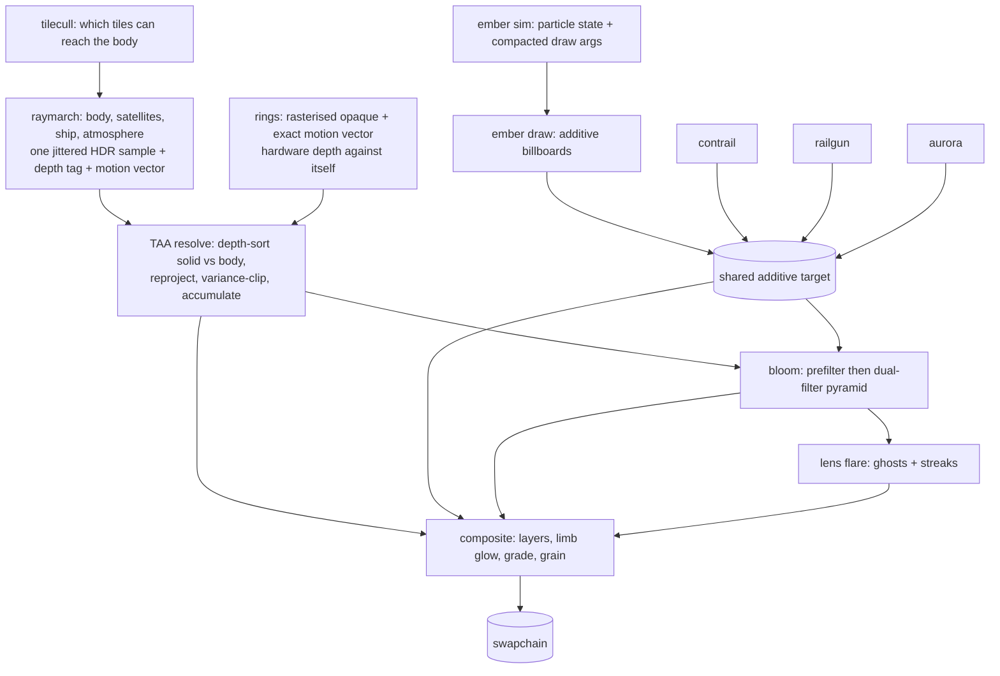

# Architecture

The README says how to run this, where each file is, and what every knob does. This document
is the layer above that: what the pieces are, who owns what, and the handful of contracts that
the whole pipeline depends on. If you are about to touch the temporal side, read
[The temporal contract](#the-temporal-contract) first — almost every bug this renderer has had
lived in it, and it is the one part where a change that looks local is not.

## What this is

A single-scene WebGPU renderer: a raymarched signed-distance planetoid on a spherical-Fibonacci
lattice, lit as a scattering medium, with rasterised metal rings, an analytic ship and
satellites, GPU particles, curl-noise auroras, a volumetric atmosphere, temporal
antialiasing with upsampling, and an analytic film grade.

It is deliberately **not** an engine. There is no scene graph, no material system, no asset
pipeline, and no build step. Everything is procedural and analytic, which is what buys the two
properties the design leans on hardest:

- **Nothing is loaded**, so the whole thing is a static page and a shader cache.
- **Everything can say where it was last frame**, because positions come from closed-form
  functions of time rather than from stored state. That is what makes exact motion vectors
  possible for moving geometry, and it is the backbone of the temporal contract below.

Two vendored MIT dependencies (`lil-gui`, `mp4-muxer`), both loaded on demand, neither on the
startup path.

## Layers and ownership

Each layer knows only about the ones below it. The arrows in the frame graph are data; the
layering here is *authority* — who is allowed to decide a thing.

| Layer | Files | Owns | Must not |
|---|---|---|---|
| Boot | `main.js` | the rAF loop, the clock, input wiring, keys, the debug surface on `window.beep` | know how any pass works |
| Frame graph | `renderer.js` | the **order** of passes, per-frame scene updates, uniform assembly | contain rendering logic |
| Passes | `passes/*.js` | how one pass records itself: pipeline, bind groups, draw | know when it runs, or what runs next |
| Resources | `core/targets.js`, `core/uniforms.js`, `core/profiler.js`, `core/device.js` | every texture and buffer, the uniform block layout, timing | make art decisions |
| Scene | `scene/*.js` | simulation and state: camera, ship, contrail, aurora, rail guns, lattice | touch the GPU |
| Tuning | `scene/tuning.js` | **every** art number, and which of them are shader constants vs runtime uniforms | contain logic |
| Shaders | `shaders/*.wgsl` | shading, marching, the resolve | allocate or decide order |

`renderer.js` owning order *and nothing else* is what makes the pipeline extensible: adding a
pass is one class plus one line. The shader include graph is kept deliberately shallow for the
same reason — `brdf.wgsl` and `fibonacci.wgsl` were extracted precisely so that lighting a
surface or drawing a star does not pull in the marched body.

## The frame graph

The ordering inside the raymarch is not arbitrary: body → satellites → ship, each narrowing the
next one's `tmax`, so the set resolves front-to-back with no sorting. The atmosphere integrates
**last**, once `tmax` is final, because it must stop at whatever ended up nearest.

### The rule that sets the order

> Anything camera-relative, or world-space dynamic that cannot say where it was last frame, must
> **not** enter the accumulation buffer.

Reprojection assumes static geometry. That single rule is why embers, flares, the limb glow, the
explosion fireballs and the grain all live downstream of TAA, and why they get no antialiasing —
a cost accepted deliberately, and measured (see `beep.additive()`).

The **rings are the exception that proves it**: they move, but analytically, so they hand TAA an
exact motion vector instead of asking it to guess. The admission criterion is not "static", it is
*"can you tell me where you were"*.

## The temporal contract

This is the load-bearing part. Four things have to agree, and they are spread across
`raymarch.wgsl`, `rings.wgsl`, `common.wgsl` and `taa.wgsl`.

### 1. Pixel centres

A pixel centre is `integer + 0.5`. `screenUV(px)` maps a pixel to shared screen space and
`uvToPixel` is its exact inverse; both assume centres. Pass a bare integer corner and you get a
half-pixel bias that is invisible in a still frame and reads as crawl in motion.

### 2. One jitter, and the one that was removed

`frame.jitter.xy` is the sub-pixel offset on the ray. **It is the antialiasing**, it is an unbounded
low-discrepancy sequence, and `PROBE.zeroJitter` (or `j`) is the only thing that turns it off. With
it off and the scene stopped, the frame is bit-exact — which is the baseline every stability figure
in this repo is measured against.

`jitter.zw` used to carry a second, unrelated thing: an offset on the lens disk for depth of field.
It is gone, and the reason is worth keeping because it is the same reason twice:

- **It could not converge.** One lens sample per frame amortised over the history never settles,
  because the variance clip pulls the history back toward each frame's newest sample. Measured on a
  stopped scene: 0.457% of pixels moving by more than 4 of 255 levels with the lens, against 0.107%
  for the pixel jitter alone.
- **It missed half the scene.** A lens offset moves a *ray origin*, which only exists in the compute
  passes. The rings are rasterised through `jitterClip(frame.viewProj * …)`, which carries the pixel
  jitter and nothing else — so at a wide aperture the rings were the only stable thing on screen.
  That asymmetry is what exposed it.

Neither jitter ever had anything to do with temporal *upsampling*, so `u` does not affect them — a
distinction that cost real debugging time. Bringing depth of field back means a deterministic
post-process gather; the design is recorded in `CAMERA` in `tuning.js`.

### 3. Three ways to answer "where was this pixel last frame"

All three must land in the **same frame of reference**: unjittered pixel centres, which is how
the history is indexed. They differ only in how they get there.

| Content | Method | Jitter handling |
|---|---|---|
| Body, sky | reproject the world hit through `prevViewProj` | subtract `jitter/toIn` — the hit is on a jittered ray |
| Rings (raster) | vertex shader emits `prevClip` | **add** jitter back to `in.pos.xy`, because `jitterClip` shifted the geometry |
| Ship, satellites (march) | `motionFor(prevWorldPos, px, owner)` | pass the **jittered** `px`, so the `-jitter` is inside the delta |

The consumer does `rp = opc + motionPx` with no correction, so the correction has to be in the
producer. Ship and satellites use one shared helper (`motionFor` in `common.wgsl`) specifically so
there is one place to be right rather than three.

Satellite previous positions come from `satFrameAt(i, t - dt)` — the same analytic orbit
evaluated one frame back. No velocity buffer, no stored state. `ringDefAt(i, t)` is the same idea
for the rings.

### 4. Depth tags

The accumulation buffer's **alpha is the hit distance**, doubling as a classifier: which object a
pixel is, and how far. Negative means background, and that is now the only negative — a second
encoding used to bias a distance into the negatives to mark geometry "dynamic", which the resolve
answered by reading history from the same screen pixel with no reprojection at all. Its last user
was the satellites, and once they carried real motion vectors it had no writers and was removed. TAA's gate compares it against the distance measured from the *previous*
camera (`prevCamPos` exists for exactly this), because a distance written by a camera that has
since moved is not comparable to one from where the camera is now.

The gate is slope-scaled, like a rasteriser's `depthBiasSlopeScale`: a flat tolerance rejects
valid history across steep surfaces, where one pixel of reprojection slide is legitimately a large
depth change.

### 5. What convergence is actually limited by

History is combined by variance clipping (Salvi/Karis) in YCoCg, not by a luma-difference guard —
the samples here are noisy by construction (few-tap AO, SSS, transmission), so any guard tight
enough to stop ghosting also stops accumulation.

The consequence is the most counter-intuitive property of the whole system, and it is measured:

> **More history does not make a noisy sample converge.** The clip box is rebuilt every frame from
> the current neighbourhood, so it pulls the history back toward the newest sample no matter how
> much weight the history carries. `weightMax` 6 → 200 and `blend` 0.15 → 0.04 both change nothing.

Two corollaries that explain otherwise-baffling tuning:

- A **per-pixel** temporal dither makes neighbours disagree, inflates sigma, and admits stale
  history *everywhere*. A **global per-frame** offset shared by all nine taps moves the box with
  the sample and is free. `volumetric.wgsl`'s step offset is built exactly that way.
- Depth of field could not converge through this at all, which is why the thin lens was removed
  rather than tuned. Any effect that needs several samples of one quantity must take them *within a
  frame*, not borrow them from previous frames.

## Resolution and resources

### Two resolutions, always

| | What | Uniform |
|---|---|---|
| Render resolution | what the march runs at | `frame.res` |
| Display resolution | what the history and output live at | `frame.accumRes` |

With temporal upsampling these differ, and **every accumulation consumer reads `accumRes` rather
than assuming they are equal**. This split is what makes dynamic resolution viable at all: the
history stays at output resolution, so changing the render scale changes only input sample
density, and accumulated detail survives the transition instead of popping.

### Target lifetimes

`targets.js` allocates everything together, because the sizes are interdependent and a partial
resize means a pass silently samples a stale texture of the wrong size.

- `own(...)` — render-resolution targets; rebuilt when the render scale changes.
- `ownOut(key, make)` — output-resolution targets; keyed and idempotent, so they survive a render-scale change untouched.
- `generation` — bumped on every rebuild. Passes compare it to invalidate cached bind groups, which hold concrete texture views and therefore cannot outlive a reallocation.

### Ping-pong parity

The accumulation flips buffers every frame while `generation` only changes on resize. A single
cached bind group is therefore wrong half the time, so passes that read the accumulation keep
**one bind group per parity** and index with `targets.accumIndex`. This bug has been found twice
in this codebase, in two copies of the same file — which is why the three additive passes are now
one class (`passes/additive.js`) parameterised by data.

### Dynamic resolution

`scene/dynres.js` holds a frame-time target by stepping a ladder of `{scale, additive}` rungs. It
uses **GPU time only** and refuses to run without timestamp queries: wall time includes present
pacing, so a vsync-limited frame reads as on-budget regardless of headroom. Raw samples are pushed
by the profiler when a readback resolves — polling smoothed values fills the window with
duplicates. Drops are fast, recovery is slow.

## Coordinate spaces

- **Shared screen space** — half-diagonal 1, y up, aspect-correct. The one space where ray
  generation, reprojection and ember billboards all agree; `screen.zw` holds the sensor half-extents.
- **Pixel space** — per-grid, centres at `+0.5`, y down. Two grids exist at once (render, display);
  `toIn` converts between them, and mixing them up is the classic failure here.
- **Body space** — the local frame of a marched or analytic object, in which a hit point is recorded
  so that the previous transform can be applied to it exactly.

## Scene state: derived vs stateful

Almost everything is a closed-form function of time, which is why the temporal contract works.
Only two things carry real state, and both for the same reason — they are *histories*, so they
cannot be recomputed:

- `contrail.js` — the ship's past positions.
- `aurora.js` — ribbon paths, integrated through curl noise with bounded turn rate.

Everything else is derived: the ship's orientation from its polar state, satellites from their
orbits, rings from `ringDefAt`, rail gun shots from a birth time plus an age.

The autopilot is a single latch (`Ship#flown`): until the player touches a flight control the ship
cruises, barrel rolls and fires on a timer. All three stop together, and `markFlown()` exists so
instruments can suppress them — a shot inside a measurement window is worth several multiples of
what is being measured.

## Instrumentation

The probes are part of the architecture, not an afterthought: this renderer has no ground truth to
compare against, so every quality claim in it is a measurement. All live in `dev/benchmark.js`,
exposed on `window.beep`, and every one stops the render loop before touching the GPU.

**The distinction that matters most** is what a probe reads:

| Reads | Probes | Blind to |
|---|---|---|
| Accumulation buffer | `shake`, `subpixel`, `detail`, `sharp`, `lag`, `additive` | the grade, bloom, flares, additive layers, grain |
| Swapchain | `still`, `record` | nothing — this is what a viewer sees |

Lessons learned the hard way, all encoded in the probes now:

- A **median over the whole frame cannot see a change confined to a small object**. `shake({tagBand})`
  scopes by depth tag; it throws rather than returning a confident `0%` on an empty mask.
- **Averaging must span longer than any cycle in the renderer**, or the result depends on where in
  the lens/jitter cycle the capture landed. `still()` averages every adjacent pair over 16 frames.
- A **plain frame-to-frame difference is dominated by legitimate motion** and scales with image
  gradient, so it ranks a sharper image as worse. `shake` uses a second difference in time, which
  cancels linear ramps and keeps flicker.
- **Freezing needs three things**: the clock, the input, *and* `dt` forced to zero — `dt` has a
  `1e-4` floor, so a repeated clock still creeps every simulation forward.

`dev/run.mjs` is the GPU-free half: pure-JS checks of the lattice bounds, the bloom prefilter, the
aurora walker and parameterisation continuity. It runs in CI-time, with no browser.

## Invariants

Break one of these and the failure will look like something else entirely.

1. Nothing enters the accumulation buffer unless it can report where it was last frame.
2. Motion vectors are measured against **unjittered pixel centres**; the producer carries the correction.
3. Pixel coordinates are centres (`+0.5`). Two pixel grids exist; never mix them.
4. Every accumulation consumer reads `accumRes`, never `res`.
5. One bind group per accumulation parity, invalidated on `generation`.
6. Art numbers live in `tuning.js`. TAA knobs are **uniforms, not shader constants**, so they can be A/B tested at runtime — as constants they were baked at pipeline creation and console tweaks silently did nothing.
7. Per-frame randomness is global-per-frame or spatial, never per-pixel-per-frame (see the clip box).
8. Instruments own the loop and restore every knob they touch in a `finally`.

## Extending it

- **A new pass** — one class in `passes/` with `init()` and `record()`, one line in `renderer.js`.
  Decide first whether it goes before or after TAA, using the rule above; that choice is the whole design.
- **New geometry in the march** — narrow `tmax` in the existing front-to-back chain, write a positive
  depth tag, and emit a motion vector via `motionFor` if it moves.
- **A new knob** — `tuning.js`. Runtime-tunable means a uniform slot; baked means a `wgslDefines`
  constant. If you might want to A/B it, it must be a uniform.
- **A new quality claim** — build the instrument first. Every number in this repo has one behind it,
  and the ones that did not turned out to be wrong.
